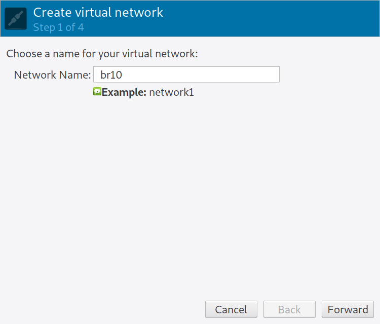
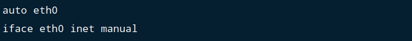

# Method 1: Creating Bridge Network using Virtual Machine Manager.

Follow these steps to create a Linux bridge from Virtual Machine Manager (GUI). You need to have installed KVM on your system.

How to install KVM on RHEL/CentOS 8, Fedora, Arch Linux, CentOS, Ubuntu/Debian.

Open Virtual Machine Manager, and go **to Edit > Connection Details > Virtual Networks**


Configure a new network interface by clicking the + at the bottom of the window. Give the virtual network a name.



Click the Forward button, on next window, provide virtual network information.


Click forward and choose if to enable IPv6.


Select the network type and forwarding policy.


Finish the setting and save your configurations. The new Virtual network should show on the overview page.


A bridge on the host system is automatically created for the network.


# Method 2: Create KVM bridge with virsh command.

Create a new bridge XML file.


Add bridge details to the file.


To define a network from an XML file without starting it, use:


To start a (previously defined) inactive network, use:


To set network to autostart at service start:


Check to Confirm if autostart flag is turned to **yes** – Persistent should read yes as well.


Confirm bridge creation and IP address.


# Method 3: Create a bridge by editing network scripts (CentOS / RHEL / Fedora):

Below script will create a bridge called br10.


With:


The configuration of **eth0** interface that I’m bridging to will be:


Restart your network daemon.

>sudo systemctl disable NetworkManager && sudo systemctl stop NetworkManager

>sudo systemctl restart network.service

# Method 4: Create a bridge by editing network scripts (Debian / Ubuntu):

Configure Bridging interface:


Disable all lines on eth0 interface section to look something like below:



Restart your networking service.


# Method 5: Using Nmcli tool

Use the **nmcli** network management command line tool to create a Linux bridge on the desired interface. Let’s first list all available connections.

```
$ sudo nmcli connection show 
NAME                UUID                                  TYPE      DEVICE 
enp1s0              498869bb-0d88-4a4c-a83a-c491d1040b0b  ethernet  enp1s0 
Wired connection 1  0977f29f-fa2e-3d7f-831c-6f41f8782be3  ethernet  enp7s0 
```

Since my bridge will be created on the second device **enp7s0**, I’ll delete the existing connection then create a bridge with this device.

```
$ sudo nmcli connection delete 0977f29f-fa2e-3d7f-831c-6f41f8782be3
Connection 'Wired connection 1' (0977f29f-fa2e-3d7f-831c-6f41f8782be3) successfully deleted.
```

1. Save bridge related information to variables.


Where:

    - BR_NAME: The name of the bridge to be created.
    - BR_INT: the physical network device to be used as bridge slave.
    - SUBNET_IP: IP address and subnet assigned to the bridge created.
    - GW: The IP address of the default gateway
    - DNS1 and DNS2: IP addresses of DNS servers to be used.


2. Define new bridge connection.

```
sudo nmcli connection add type bridge autoconnect yes con-name ${BR_NAME} ifname ${BR_NAME}
```
Output:

```
Connection 'br0' (be6d4520-0257-49c6-97c2-f515d6554980) successfully added.
```

3. Modify bridge to add IP address, Gateway and DNS

```
sudo nmcli connection modify ${BR_NAME} ipv4.addresses ${SUBNET_IP} ipv4.method manual
sudo nmcli connection modify ${BR_NAME} ipv4.gateway ${GW}
sudo nmcli connection modify ${BR_NAME} ipv4.dns ${DNS1} +ipv4.dns ${DNS2}
```

4. Add the network device as bridge slave.

```
sudo nmcli connection delete ${BR_INT}
sudo nmcli connection add type bridge-slave autoconnect yes con-name ${BR_INT} ifname ${BR_INT} master ${BR_NAME}
```

Sample output.

```
Connection 'enp7s0' (f033dbc9-a90e-4d4c-83a9-63fd7ec1cdc1) successfully added.
```
Check connections.


## Step 2: Bring up network bridge

Once the network bridge connection has been created, bring it up.

```
$ sudo nmcli connection up br10
Connection successfully activated (master waiting for slaves) (D-Bus active path: /org/freedesktop/NetworkManager/ActiveConnection/5)
```

View bridge details by running.


The **ip addr** command should give output similar to below.

```
$ ip ad
3: enp7s0:  mtu 1500 qdisc fq_codel master br10 state UP group default qlen 1000
     link/ether 52:54:00:a2:f6:a8 brd ff:ff:ff:ff:ff:ff
 4: br10:  mtu 1500 qdisc noqueue state UP group default qlen 1000
     link/ether 52:54:00:a2:f6:a8 brd ff:ff:ff:ff:ff:ff
     inet 192.168.122.10/24 brd 192.168.122.255 scope global noprefixroute br10
        valid_lft forever preferred_lft forever
     inet6 fe80::4f2f:ce6d:dc6b:2101/64 scope link noprefixroute 
        valid_lft forever preferred_lft forever
```

Congratulations!!.
