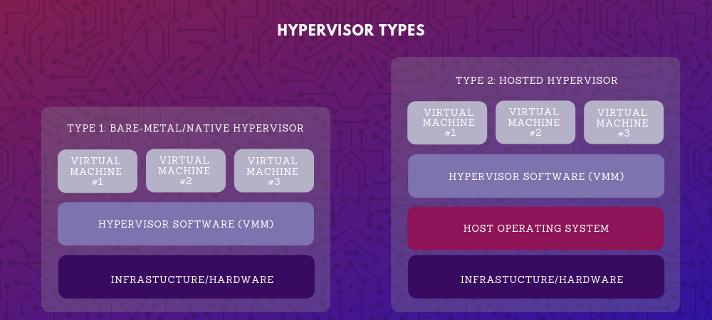

**If you're starting with cloud and virtualized systems, it's important to understand how to apply solutions like Hyper-V, KVM,vSphere or XenApp. Starting to work with a virtual machine may be advantageous as it's an efficient and isolated duplicate of a real machine. It is highly available and it enables fast disaster recovery.**

Virtualization technology also expands the capabilities of your hardware, helps you control IT-related costs, and helps you improve on your system's reliability and security.

## **What is Hypervisor?**

**A hypervisor is computer software or hardware that enables you to host multiple virtual machines. Each virtual machine is able to run its own programs. A hypervisor allows you to access several virtual machines that are all working optimally on a single piece of computer hardware.**

For the most part, cloud computing entails you being able to access a virtual machine for you to be able to do what you need to do anywhere. A hypervisor manages these virtual machines.

With a hypervisor, each virtual machine or operating system you have will be able to run its own programs, as it will appear that the system has the host hardware's processor, memory and resources. In reality, however, it is actually the hypervisor that is allocating those resources to the virtual machines.

You may think that the hypervisor is a fairly recent phenomenon. The first hypervisors were introduced in the 1960s to allow for different operating systems on a single mainframe computer. However, its current popularity is largely due to Linux and Unix. Around **2005**, Linux and Unix systems started using virtualization technology to expand hardware capabilities, control costs, and improved reliability and security that hypervisors provided to these systems.

**Now, hypervisors are fundamental components of any virtualization effort. You can think of it as the operating system for virtualized systems. It can access all physical devices residing on a server. It can also access the memory and disk. It can control all aspects and parts of a virtual machine.**

## **How does it work?**

The servers would need to execute the hypervisor. The hypervisor, in turn, loads the client operating systems of the virtual machines. The hypervisor allocates the correct CPU resources, memory, bandwidth and disk storage space for each virtual machine.

A virtual machine can create requests to the hypervisor through a variety of methods, including API calls.

**There are two types of hypervisors:**

1. Embedded or hosted hypervisors.

2. Bare metal or native hypervisors.

**Bare metal, native or type I hypervisors**

This is when the hypervisors are run on the host's hardware to control it as well as manage the virtual machines on it.

If you are currently using Microsoft Hyper-V hypervisor, VMware ESX/ESXi, Oracle VM Server for x86, KVM, or Citrix XenServer, then this is the type of hypervisor with which you are working.

These types of hypervisors are installed directly on physical servers and the hardware underneath. The bare metal term comes from the fact that there is no operating system or software in between.

**Embedded, hosted or type II hypervisors**

These hypervisors are run as a software using an operating system such as Windows, Linux or FreeBSD. This is what the Virtage hypervisor, VirtualBox and VMWare Workstation are classified as.

So, native hypervisors run directly on the hardware while a hosted hypervisor needs an operating system to do its work. Which one is better? It depends on what you're after.

Bare metal hypervisors are faster and more efficient as they do not need to go through the operating system and other layers that usually make hosted hypervisors slower. Type I hypervisors are also more secure than type II hypervisors.

Hosted hypervisors, on the other hand, are much easier to set up than bare metal hypervisors because you have an OS to work with. These are also compatible with a broad range of hardware.

[Virsh commands cheatsheet to manage KVM guest virtual machines](https://gitea.86thumbs.net/Abdellah/Project_Hypervisor_KVM_Virtualization/src/branch/master/Virsh%20commands%20cheatsheet.md)