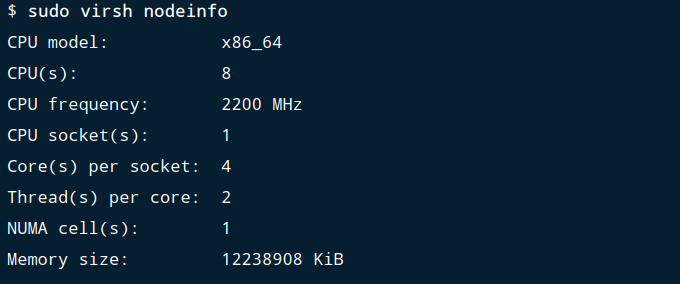
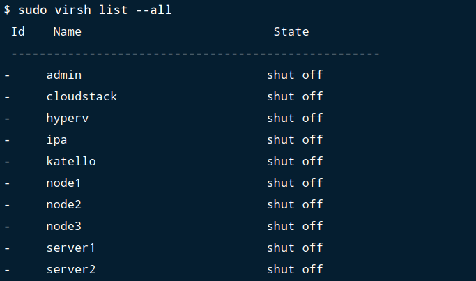
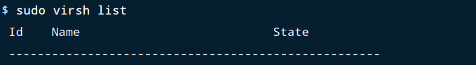
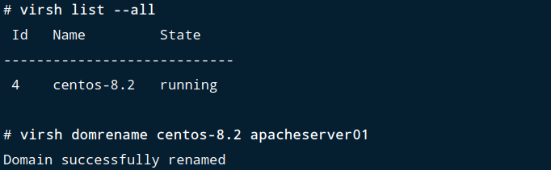
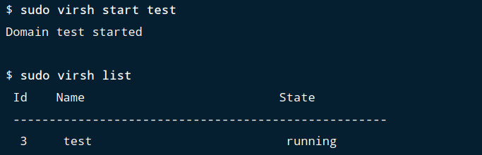
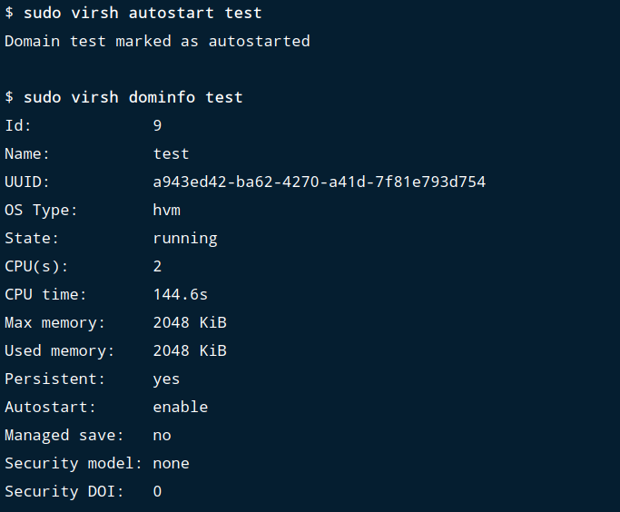
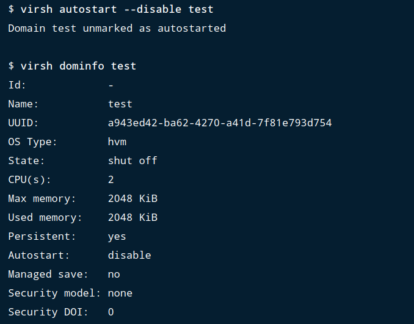
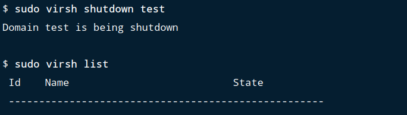
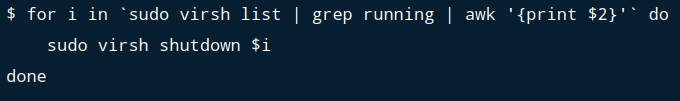
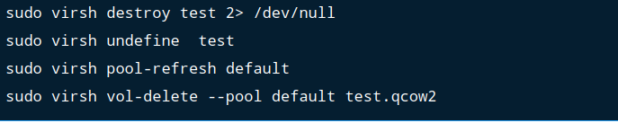

# Virsh commands cheatsheet to manage KVM guest virtual machines.

This is a comprehensive virsh commands cheatsheet: Virsh is a management user interface for virsh guest domains. Virsh can be used to create, pause, restart, and shutdown domains. In addition, virsh can be used to list current domains available in your Virtualization hypervisor platform.

Virsh interacts with Libvirt which is a library aimed at providing a long-term stable C API. It currently supports Xen, QEMU, KVM, LXC, OpenVZ, VirtualBox and VMware ESX.

## Virsh commands cheatsheet

In this virsh commands cheatsheet, I’ll show you most used virsh commands to manage Guest Virtual Machines running on KVM or Xen Hypervisor.

The basic structure of most virsh usage is:


### Virsh display node information:

This is the first item on our virsh commands cheatsheet. This displays the host node information and the machines that support the virtualization process.



### List os variants

To get the value for the **--os-variant** run the following command:


### Virsh list all domains

To list both inactive and active domains, use the command:



### List only active domains

To list only active domains with **virsh** command, use:



### Virsh rename domain

Syntax:


List available domains



We have changed the name of the domain from ***centos-8.2 to apacheserver01***

### Virsh change domain boot disk

Edit the domain by passing its name:


Scroll down until <devices> section and modify values for the line below:


Example


### Virsh start vm

This is an example on how to use virsh command to start a guest virtual machine. We’re going to start **test** domain displayed above:



### Virsh autostart vm

To set a vm to start automatically on system startup, do:




Keep an eye on the option **Autostart: enable.**

### Virsh autostart disable

To disable autostart feature for a vm:



### Virsh stop vm, virsh shutdown vm

To shutdown a running vm gracefully use:



### Virsh force shutdown vm

You can do a forceful shutdown of active domain using the command:


### Virsh stop all running vms

In case you would like to shutdown all running domains, just issue the command below:



Or use the script file [Here](https://gitea.86thumbs.net/Abdellah/Project_Hypervisor_KVM_Virtualization/src/branch/master/scripts/stop_all_running_vms.sh)

### Virsh reboot vm

To restart a vm named **test**, the command used is:


### Virsh remove vm

To cleanly remove a vm including its storage columes, use the commands shown below. The domain **test** should be replaced with the actual domain to be removed.



In this example, storage volume is named ***/var/lib/libvirt/images/test.qcow2***

You can also use undefine with **remove-all-storage** option:


### Virsh create a vm

If you would like to create a new virtual machine with virsh, the relevant command to use is **virt-install**. This is crucial and can’t miss on virsh commands cheatsheet arsenal. The example below will install a new operating system from CentOS 7 ISO Image.

```
sudo virt-install \
--name centos7 \
--description "Test VM with CentOS 7" \
--ram=1024 \
--vcpus=2 \
--os-type=Linux \
--os-variant=rhel7 \
--disk path=/var/lib/libvirt/images/centos7.qcow2,bus=virtio,size=10 \
--graphics none \
--location /var/lib/libvirt/iso/CentOS-7-x86_64-Everything-1611.iso \
--network bridge:virbr0 \
--console pty,target_type=serial -x 'console=ttyS0,115200n8 serial'
```

>At your disposal [Here](https://gitea.86thumbs.net/Abdellah/Project_Hypervisor_KVM_Virtualization/src/branch/master/scripts/) several modifiable bash scripts for the installation of Vms.


