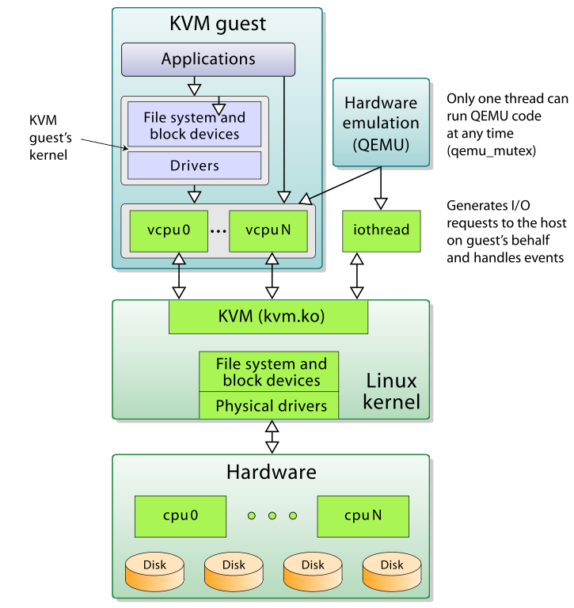

## What is KVM?

Kernel-based Virtual Machine (KVM) is an open source virtualization technology built into Linux®. Specifically, KVM lets you turn Linux into a hypervisor that allows a host machine to run multiple, isolated virtual environments called guests or virtual machines (VMs).

KVM is part of Linux. If you’ve got Linux 2.6.20 or newer, you’ve got KVM. KVM was first announced in 2006 and merged into the mainline Linux kernel version a year later. Because KVM is part of existing Linux code, it immediately benefits from every new Linux feature, fix, and advancement without additional engineering.

## How does KVM work?

KVM converts Linux into a type-1 (bare-metal) hypervisor. All hypervisors need some operating system-level components—such as a memory manager, process scheduler, input/output (I/O) stack, device drivers, security manager, a network stack, and more—to run VMs. KVM has all these components because it’s part of the Linux kernel. Every VM is implemented as a regular Linux process, scheduled by the standard Linux scheduler, with dedicated virtual hardware like a network card, graphics adapter, CPU(s), memory, and disks.

clear
